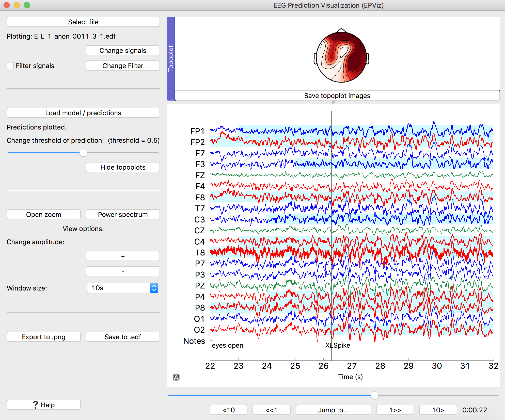

# EPViz (EEG Prediction Visualizer)

EPViz is a tool to aid researchers in developing, validating, and reporting their predictive modeling outputs. A lightweight and standalone software package developed in Python, EPViz allows researchers to load a PyTorch deep learning model, apply it to the EEG, and overlay the output channel-wise or subject-level temporal predictions on top of the original time series. 

Installation:
-----
Clone the repository ```git clone https://github.com/jcraley/epviz.git```  

Python >= 3.7 is required. Other packages can be installed by creating a virtual environment and using the provided requirements.txt file.

To create the virtual environment:  
```
python3 -m venv eeg-gui-venv
``` 

Activate the environment (MacOS and Linux):
```
source eeg-gui-venv/bin/activate
```  
Activate the environment (Windows):
```
.\eeg-gui-venv\Scripts\activate
```

Install required packages:  
```
pip install numpy==1.21.2
pip install -r requirements.txt
```

Running the visualizer:
-----
You can then run the visualizer from the main folder using  
    ```python visualization/plot.py```
    
For more command line options, see the section below. 
    
Features:
-----
***EDF files:***  
Average reference and longitudinal bipolar montages with the typical channel naming conventions are supported. Other channels can be plotted but will not be considered part of the montage. 

***Loading predictions:***  
Predictions can be loaded as pytorch (.pt) files or using preprocessed data and a model (also saved as .pt files). In both cases, the output is expected to be of length (number of samples in the edf file / k) = c where k and c are integers. Channel-wise predictions will be plotted starting from the top of the screen. 

***Saving to .edf:***  
This will save the signals that are currently being plotted. If the signals are filtered and predictions are plotted, filtered signals will be saved and predictions will be saved as well. 

***Saving to .png:***  
This will save an image of the current graph along with any predictions that are plotted. 

Documentation:
-----
You can find documentation [here](https://engineering.jhu.edu/nsa/links/epviz/).



Command line options:
-----
We have added command line options to streamline use: 
```
python visualization/plot.py --show {0 | 1} --fn [EDF_FILE] --montage-file [TXT_FILE] 
--predictions-file [PT_FILE] --prediction-thresh [THRESH]
--filter {0 | 1} [LOW_PASS_FS] [HIGH_PASS_FS] [NOTCH_FS] [BAND_PASS_FS_1] [BAND_PASS_FS_2] 
--location [INT] --window-width {5 | 10 | 15 | 20 | 25 | 30} --export-png-file [PNG_FILE]
--plot-title [TITLE] --print-annotations {0 | 1} --line-thickness [THICKNESS] --font-size [FONT_SIZE]
--save-edf-fn [EDF_FILE] --anonymize-edf {0 | 1}
```
These options include:

* Whether or not to show the visualizer
* The .edf file to load
* What montage to use
* Predictions to load
* Threshold to use for the predictions
* Filter specifications
* Where in time to load the graph
* How many seconds to show in the window
* Name of .png file to save the graph
    * The title of the saved graph
    * Whether to show annotations on the saved graph
    * Line thickness of the saved graph
    * Font size for the saved graph
* Name of the .edf file to save
    * Whether or not to anonymize the file

Tests:
-----
Unit tests are located in the tests directory. To run the tests:
```
./run_tests
```

Style guide:
-----
We are using Pylint to comply with PEP8 style guidelines.

To run Pylint on the visualizer code:
```
./run_pylint
```

Find an issue? [Let us know](https://github.com/jcraley/epviz/issues).


Test files:
-----
Test files come from the CHB-MIT database [1, 2](https://physionet.org/content/chbmit/1.0.0/) and the TUH EEG Corpus [3](https://isip.piconepress.com/projects/tuh_eeg/html/overview.shtml). The license for the CHB-MIT data can be found [here](https://physionet.org/content/chbmit/view-license/1.0.0/).

The test files used in this repo are chb01_03 (from CHB) and 00013145_s004_t004 (from TUH). They have been renamed for convenience. 

Citations for CHB-MIT dataset:
1. Ali Shoeb. Application of Machine Learning to Epileptic Seizure Onset Detection and Treatment. PhD Thesis, Massachusetts Institute of Technology, September 2009.
2. Goldberger, A., Amaral, L., Glass, L., Hausdorff, J., Ivanov, P. C., Mark, R., ... & Stanley, H. E. (2000). PhysioBank, PhysioToolkit, and PhysioNet: Components of a new research resource for complex physiologic signals. Circulation [Online]. 101 (23), pp. e215–e220.
